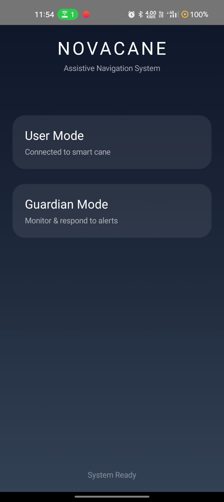

# NovaCane — Smart Assistive Safety System for Visually Impaired Users

<p align="center">
  
</p>

## Overview

NovaCane is an IoT-powered assistive safety system designed to improve mobility and emergency response for visually impaired users.

The system combines:

* Real-time obstacle detection
* Voice-based navigation feedback
* Haptic alerts
* Emergency SOS communication
* Guardian monitoring and acknowledgment

NovaCane integrates an ESP32-based smart cane with an Android application using Bluetooth and Firebase for real-time communication.

---

# Key Highlights

* Real-time obstacle detection using ultrasonic sensing
* Blind-friendly voice guidance using Text-to-Speech (TTS)
* Distinct vibration patterns for hazard awareness
* Physical SOS trigger using hardware switch
* Double-confirmation emergency workflow to prevent accidental alerts
* Guardian monitoring dashboard
* Live location synchronization using Firebase
* Two-way emergency acknowledgment system
* Real-time Bluetooth communication between hardware and mobile application

---

# System Architecture

```text
ESP32 Smart Cane
        ↓
Bluetooth Communication
        ↓
Android User Application
        ↓
Firebase Realtime Database
        ↓
Guardian Monitoring Application
```

---

# Emergency Response Workflow

```text
User triggers SOS switch
        ↓
System asks for confirmation
        ↓
User confirms emergency
        ↓
Guardian receives alert
        ↓
Guardian tracks user location
        ↓
Guardian marks user as safe
        ↓
User receives acknowledgment through voice + vibration
```

---

# Accessibility-Focused Design

NovaCane was designed with accessibility as a primary objective rather than an afterthought.

### Accessibility Features

* Voice-based obstacle warnings
* Blind-friendly interaction flow
* Audio confirmation for critical actions
* Distinct vibration patterns for different alert levels
* Reduced dependency on visual interaction
* Emergency reassurance through guardian acknowledgment

---

# Technology Stack

## Mobile Application

* Kotlin
* Jetpack Compose
* Android ViewModel
* Coroutines
* Firebase Realtime Database
* Android Bluetooth APIs

## Embedded System

* ESP32
* Arduino Framework
* Bluetooth Classic
* HC-SR04 Ultrasonic Sensor

---

# Hardware Components

| Component                 | Purpose                      |
| ------------------------- | ---------------------------- |
| ESP32                     | Main microcontroller         |
| HC-SR04 Ultrasonic Sensor | Obstacle detection           |
| Toggle Switch             | Physical SOS trigger         |
| Android Smartphone        | User and guardian interfaces |

---

# Screenshots

## Home Screen


## User Screen


## Guardian Screen


---

# Engineering Challenges Solved

### Reliable SOS Workflow

Implemented a confirmation-based emergency system to reduce accidental SOS triggers.

### Blind-Friendly Feedback Loop

Integrated voice and haptic confirmations to ensure the user receives immediate feedback during emergency actions.

### Real-Time Guardian Communication

Established Firebase-based synchronization for live emergency updates and location tracking.

### Bluetooth Stability Management

Designed reconnection-aware communication logic for maintaining reliable hardware interaction.

---

# Future Improvements

* AI-based obstacle classification
* BLE optimization for lower power consumption
* Multi-sensor navigation support
* Fall detection system
* Smart environmental awareness
* Offline emergency handling

---

# Project Status

Prototype completed and tested for real-time assistive safety workflows.

---

# Author

**Basil**

Computer Science Engineering Student

---

# Disclaimer

NovaCane is currently a prototype system developed for academic and research purposes.
